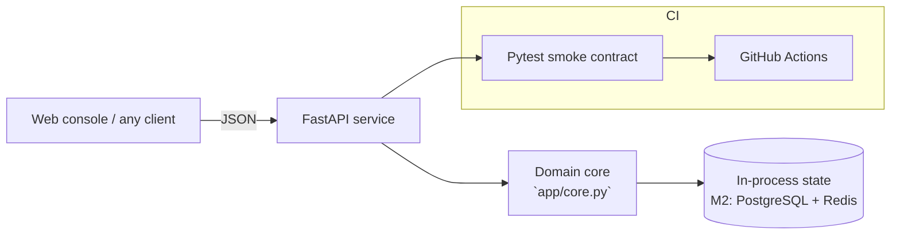

# HELM — MLOps Model Control Plane

**Domain:** MLOps · Model Governance · Drift Monitoring

## Problem

Teams ship models with no promotion gates or drift detection; silent degradation reaches production and nobody can say which version is live.

## Solution

A model control plane: versioned registry, metric-gated canary promotion (AUC threshold), and PSI-based drift detection that recommends retrain/shadow actions. Pure-Python statistical core, registry-pattern API ready to back onto MLflow.

## Why this project for the **AI Engr I** role at **Honeywell Aerospace Technologies**

This system was scoped to demonstrate, end to end, the skills the job description emphasises: **Machine Learning**. Milestone M1 is fully implemented and tested in this repo; M2–M4 are the documented growth path.

## Architecture



The core is intentionally dependency-free (FastAPI + stdlib) so it runs
anywhere in seconds; every integration point for production hardening is
marked in the milestone plan.

## API surface

| Method | Path |
|---|---|
| `GET` | `/health` |
| `POST` | `/api/models` |
| `POST` | `/api/models/churn/promote` |
| `POST` | `/api/drift` |

Interactive docs: `http://localhost:8000/docs`

## Quickstart

```bash
cd backend
pip install -r requirements.txt
uvicorn app.main:app --reload          # http://localhost:8000
python -m pytest -q                    # smoke contract
```

Or with Docker:

```bash
docker compose up --build
```

## Impact

- Promotion gate blocks under-threshold models automatically — no more 'it looked fine locally'
- PSI drift endpoint turns a vague 'model feels off' into a quantified stable/moderate/severe signal with an action

## Roadmap

- M1 (shipped): registry, gated promotion, PSI drift API, dashboard, CI
- M2: MLflow backend + artifact storage (S3/GCS), model cards
- M3: shadow deployments and automated retrain triggers via GitHub Actions
- M4: Grafana/Prometheus exporter + Kubernetes operator for rollout

## Tech & concepts

MLOps, MLflow, Kubeflow, CI/CD, Docker, Kubernetes, Monitoring & Observability, Machine Learning, Model Optimization, Terraform, AWS, Google Cloud Platform, Microsoft Azure
